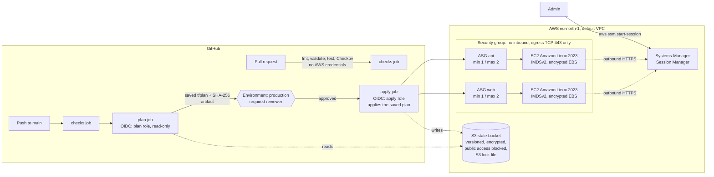

# AWS Self-Healing Infrastructure (Terraform + GitHub Actions)

Two small services (`web` and `api`) on EC2, each managed by an Auto Scaling Group that replaces failed instances automatically. Everything is defined in Terraform and deployed through a GitHub Actions pipeline: you review a saved plan, approve it, and the pipeline applies exactly that plan. There are no SSH ports and no long-lived AWS keys.

I built this to understand how infrastructure recovers from failure, and I tested the recovery on my own AWS account (see [Evidence](#evidence-what-was-actually-tested)).

## Architecture



## Repository structure

```
.
├── versions.tf              # Terraform version, AWS provider, S3 backend (encrypted, locked)
├── main.tf                  # security group, IAM instance role (SSM), two services
├── variables.tf             # inputs with validation
├── outputs.tf
├── modules/server/          # launch template + Auto Scaling Group (reused for web and api)
├── bootstrap/               # SEPARATE config: state bucket hardening + GitHub OIDC roles
├── tests/security.tftest.hcl  # offline tests with a mocked AWS provider
├── .checkov.yaml            # security scanner settings
├── .github/workflows/terraform.yml
└── screenshots/             # evidence from real runs
```

## Design decisions

| Decision | Why |
|---|---|
| **No SSH, Session Manager instead** | Port 22 open to `0.0.0.0/0` is one of the most scanned attack surfaces. The SSM Agent opens an outbound HTTPS connection, so instances need no inbound rules, no key pairs and no bastion host. Access is controlled and logged through IAM. |
| **Egress limited to TCP 443** | Needed for the SSM endpoints and the Amazon Linux package repositories. Nothing else leaves the instance. |
| **IMDSv2 required** | Blocks SSRF attacks that steal instance credentials from the metadata service. |
| **Amazon Linux 2023 from the AWS SSM parameter** | Always the current patched AMI, with the SSM Agent preinstalled. You can still override it with `ami_id`. |
| **Bootstrap separated from main config** | The state bucket used to be created by the same configuration that stores its state in it, so `terraform destroy` would have tried to delete its own state. |
| **S3 native state locking (`use_lockfile`)** | Prevents two runs from writing the state at the same time, without a DynamoDB table. Requires Terraform/OpenTofu ≥ 1.10. |
| **Saved plan + approval + `apply tfplan`** | The old pipeline approved one plan and then ran a *fresh* `apply -auto-approve`, which could apply something different. Now apply uses the exact reviewed plan file. Terraform refuses if anything changed in between ("stale plan"), and a SHA-256 check confirms the artifact was not modified. |
| **GitHub OIDC instead of access keys** | No long-lived credentials in GitHub. The plan role can only be assumed from `main`. The apply role can only be assumed from the `production` environment, which requires approval. Pull requests get no AWS credentials at all. |
| **Apply role IAM is scoped** | It can only create roles named `self-healing-*`, attach only `AmazonSSMManagedInstanceCore` to them and pass them only to EC2. This blocks the classic escalation path where CI attaches AdministratorAccess to a role it creates. |

## Health checks: what the ASG does and does not detect

The Auto Scaling Groups use **EC2 health checks**. An instance is replaced if it is terminated, stopped or fails EC2 status checks. There is **no load balancer and no application**, so a crashed web server process would **not** be detected. Adding an ALB with HTTP health checks is the next step (see [Limitations](#limitations-and-next-steps)).

## Evidence: what was actually tested

- **Self-healing (real AWS, 2026-10-03, earlier version of this code):** I terminated the running `web` instance in the AWS Console. The ASG activity log shows the instance taken out of service after the EC2 health check and a replacement launched at the same timestamp (15:30:32 UTC).
  
- **Approval gate (real GitHub Actions run, earlier pipeline version):** the apply job waited for approval in the `production` environment.
  
- **This version (security hardening + new pipeline) has NOT been applied to AWS yet.** It has been checked offline only:
  - `tofu fmt -check`, `tofu validate` (main + bootstrap): pass (OpenTofu 1.10.6, AWS provider 6.66.0)
  - `tofu test` with a mocked AWS provider: 8/8 pass. Checks: no inbound rules, egress TCP 443 only, IMDSv2 required, encrypted root volume, SSM policy attached, AL2023 default AMI, and rejection of large instance types, invalid AMI IDs and invalid environment names. A mutation test (re-adding SSH 0.0.0.0/0) makes the test fail as expected.
  - Checkov 3.2.469: 117 passed, 0 failed, 6 skipped with written justifications (inline `#checkov:skip` comments).
  - actionlint on the workflow: pass.

## Setup

### Prerequisites

- AWS account and an admin profile for the one-time bootstrap
- Terraform ≥ 1.10 or OpenTofu ≥ 1.10
- AWS CLI v2 + [Session Manager plugin](https://docs.aws.amazon.com/systems-manager/latest/userguide/session-manager-working-with-install-plugin.html) (for shell access)

### 1. Bootstrap (once, from your machine, with admin credentials)

```bash
cd bootstrap
terraform init
terraform plan    # the existing bucket is imported, not recreated
terraform apply
terraform output  # copy the two role ARNs
```

Bootstrap keeps its state **locally** (it creates the bucket that would hold it). Back up `bootstrap/terraform.tfstate` somewhere safe and never commit it (it is git-ignored). If the GitHub OIDC provider already exists in the account, add `-var create_github_oidc_provider=false`.

### 2. Remove the bucket from the main state (one time)

The main configuration contains a `removed { lifecycle { destroy = false } }` block. On the next apply it **forgets** the bucket without deleting it, and from then on only bootstrap manages the bucket. The plan should show `aws_s3_bucket.asa_s3 will no longer be managed by Terraform` and **no** `destroy`.

### 3. GitHub settings

| Setting | Value |
|---|---|
| Repository variable `AWS_PLAN_ROLE_ARN` | `github_plan_role_arn` output |
| Environment `production` → required reviewers | yourself |
| Environment `production` → deployment branches | `main` only |
| `production` environment variable `AWS_APPLY_ROLE_ARN` | `github_apply_role_arn` output |
| Delete old secrets | `AWS_ACCESS_KEY_ID`, `AWS_SECRET_ACCESS_KEY` (then deactivate that IAM user's keys) |
| Branch protection on `main` | require the `checks` job to pass |

### 4. Deploy

Open a pull request. The checks run without AWS access. Merge to `main`. Review the plan in the run summary, then approve the `production` deployment. The apply job applies that exact plan.

### Connect to an instance (no SSH)

```bash
aws ssm start-session --target i-xxxxxxxxxxxxxxxxx --region eu-north-1
```

Instances launched **before** this change do not have the instance profile yet. Terminate one, and the ASG replaces it from the new launch template, which also re-runs the self-healing test.

### Run checks locally

```bash
terraform fmt -check -recursive
terraform init -backend=false && terraform validate && terraform test
pip install checkov && checkov --directory . --config-file .checkov.yaml
```

## Cost and cleanup

Resources that cost money while running:

- **2 × t3.micro EC2** (one per ASG; up to 4 if both scale out) plus **2 × 8 GB gp3 EBS**. Free-tier eligible for new accounts; otherwise billed hourly at the on-demand rate (see the [EC2 pricing page](https://aws.amazon.com/ec2/pricing/on-demand/) for eu-north-1).
- **S3 state bucket:** a few KB, negligible. Old versions expire after 90 days.

IAM roles, security groups, launch templates and the OIDC provider are free.

Cleanup:

```bash
terraform destroy            # removes ASGs, instances, launch templates, SG, IAM role
# The state bucket and CI roles stay (bootstrap, prevent_destroy).
# To remove them too: delete prevent_destroy in bootstrap/state_bucket.tf, then
cd bootstrap && terraform destroy
```

Setting `desired_capacity`/`min_size` to 0 also stops all EC2 charges while keeping the setup.

## Security considerations

- No inbound ports. Admin access only through Session Manager, controlled by IAM.
- No long-lived AWS credentials in CI. Pull requests cannot obtain AWS credentials.
- State is encrypted, versioned, private and accessible only over TLS. It is locked during runs.
- Plan artifacts are kept for 3 days. This configuration has no sensitive variables, but if any are added, encrypt the plan artifact before upload.
- Third-party GitHub Actions are pinned to major versions. Pinning to commit SHAs is stricter (left as a follow-up).

## Limitations and next steps

- No load balancer or application: the health checks are EC2-level only.
- Uses the default VPC with public subnets. A dedicated VPC with private subnets and VPC endpoints for SSM would remove the need for internet egress entirely.
- No instance refresh: launch template changes affect only newly launched instances.
- The security group keeps its legacy name `allow_ssh` to avoid replacing it while instances are attached. Rename it after the instances have been refreshed.
