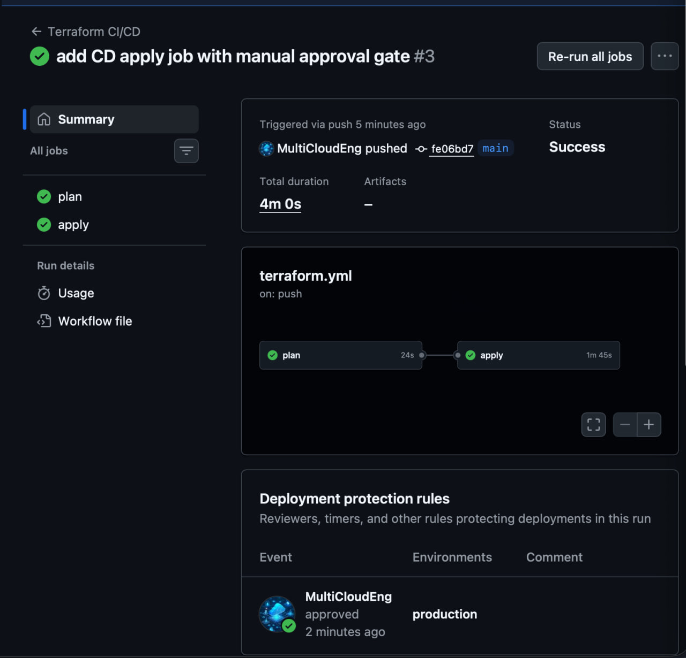
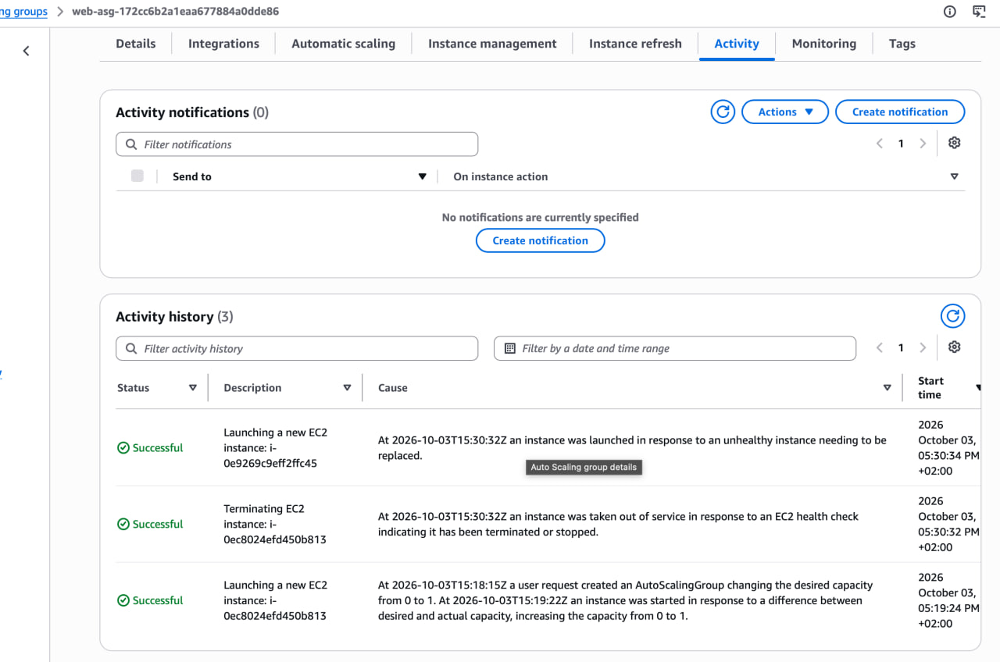

 AWS Self-Healing Infrastructure

Personal project — AWS infrastructure built with Terraform, with a CI/CD pipeline and self-healing setup.

I wanted to actually understand how real infrastructure stays up when something breaks, not just read about it, so I built this and tested it on my own AWS account.
 What it does

Two services, `web` and `api`, each running on AWS EC2 behind an Auto Scaling Group instead of a single fixed server. If an instance crashes or gets terminated, the ASG notices and launches a new one automatically — no one has to fix it by hand.

- `aws_launch_template` — defines how a new instance should be built (AMI, instance type, security group)
- `aws_autoscaling_group` — keeps 1-2 healthy instances running at all times
- Terraform state stored in S3
- Subnets pulled dynamically from the default VPC instead of hardcoded

 CI/CD

GitHub Actions runs on every push to `main`:

1. `plan` job — runs automatically, checks what would change
2. `apply` job — waits for my manual approval before touching real infrastructure (GitHub Environment with a required reviewer)

So changes get validated automatically, but nothing actually deploys without me approving it first.

## Proving it actually works

Talk is cheap, so I manually killed one of the running `web` instances in the AWS Console to see what happens. The Auto Scaling Group picked it up and launched a replacement by itself within a couple minutes.

 Stack

Terraform, AWS (EC2, Auto Scaling, S3, VPC), GitHub Actions
